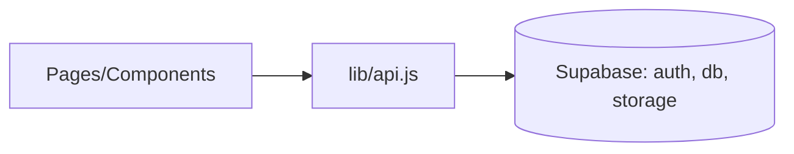

# FlavorShare Frontend (React)

A responsive React application for discovering and sharing recipes, themed with "Ocean Professional", and integrated with Supabase for auth, database, and storage.

## Quick start

1. Install dependencies
   - npm install

2. Configure environment
   - cp .env.example .env
   - Fill in:
     - REACT_APP_SUPABASE_URL
     - REACT_APP_SUPABASE_KEY
     - Optionally set REACT_APP_FRONTEND_URL (used for email redirect on sign-up)
   - Note: Other variables may exist in your container's .env; only the above are required for Supabase integration. REACT_APP_PORT can override the dev server port.

3. Provision Supabase (database + storage)
   - Open your Supabase project -> SQL Editor
   - Run the SQL from: ../supabase/schema.sql
     - Tables: profiles, recipes, tags, recipe_tags, favorites, follows, comments
     - RLS: enabled with policies for select/insert/update/delete
     - Storage: buckets 'recipe-images' and 'avatars' with public read; authenticated users can write
   - Optional: Uncomment and adapt seed examples inside schema.sql to create initial demo data.
   - Ensure Authentication (Email/Password) is enabled in your project.

4. Run the app
   - npm start
   - The dev server uses HOST=0.0.0.0, BROWSER=none and defaults to port 3000 (override with REACT_APP_PORT).

5. Build for production
   - npm run build

## Required environment variables

See .env.example for full list. Minimum required for Supabase:
- REACT_APP_SUPABASE_URL
- REACT_APP_SUPABASE_KEY

Optional:
- REACT_APP_FRONTEND_URL (used for email redirect on sign-up confirmation)
- REACT_APP_PORT (dev server port override)

If REACT_APP_SUPABASE_URL or REACT_APP_SUPABASE_KEY are missing at runtime, the app will warn in console and Supabase requests will fail.

## Features
- Authentication (register, login, logout)
- Recipe CRUD (create, edit, detail)
- Public feed on Home
- Profiles and Settings
- Search with debounce
- Image uploads to Supabase Storage (recipe-images, avatars)
- Accessible, responsive UI

## Current limitations and extension tips
- Tag filter UI (Home sidebar) is present but not yet wired to back-end filtering. To implement:
  - Create a Postgres view or extend recipesApi.list to join recipe_tags and filter when a tagId is selected.
- Avatar upload UI is not exposed in Settings yet. The storage helper uploadAvatar(file, userId) is available; you can add a file input in Settings and update profiles.avatar_url with the returned publicUrl.

## Validation & troubleshooting

Use this checklist to validate end-to-end integration:

1) Environment
- Verify .env has REACT_APP_SUPABASE_URL and REACT_APP_SUPABASE_KEY set to your Supabase project.
- Optionally set REACT_APP_FRONTEND_URL to your app URL for email confirmation redirects.

2) Database & storage
- Run ../supabase/schema.sql in Supabase SQL Editor.
- Confirm buckets: recipe-images, avatars exist (Storage -> Buckets).
- RLS policies from schema.sql will allow:
  - Public read on recipes/profiles/tags and on recipe-images/avatars buckets
  - Authenticated users can write to storage, with avatars writes scoped to <uid>/ paths.

3) Authentication
- Register a new user on /register (email/password). A profile row is upserted automatically.
- Login on /login and verify header shows authenticated nav (Profile, Settings, Logout).
- Logout returns you to the public state.

4) Recipe flows
- Create a recipe on /recipes/new with a cover image; verify the image is uploaded to recipe-images and cover_url is visible in feed and /recipes/:id.
- Edit the recipe on /recipes/:id/edit and optionally replace the image.
- Delete the recipe on its detail page; only the owner can edit/delete.

5) Search
- Use the header search or /search page; results filter by title using ilike. Pagination is applied internally (default 12 per page).

6) Profiles & Settings
- Visit /profile/:id to see the user's profile and recipes.
- Update username/bio in /settings. To add an avatar:
  - Extend Settings with a file input and call uploadAvatar(file, user.id), then update profiles.avatar_url with the returned publicUrl.

7) Visibility rules
- As a guest user, you should still be able to browse public profiles, recipes, tags, and see images via public URLs.
- Only authenticated users can modify their own data (enforced by RLS).

Common issues:
- 401/permission errors: Ensure you are logged in and that schema.sql policies have been applied.
- Storage upload fails: Confirm buckets exist and you are authenticated; check that the role has insert policy (provided in schema.sql).
- Email sign-up redirect: Set REACT_APP_FRONTEND_URL in .env to your app origin.

## Tech
- React 18 + react-router-dom
- @supabase/supabase-js
- Vanilla CSS (src/theme.css) imported globally via src/index.js

## Notes
- Protected routes: create/edit, settings (via components/ProtectedRoute).
- Storage requires buckets: "recipe-images", "avatars" with public access or policies providing read.
- Database tables expected: profiles, recipes, tags, recipe_tags, favorites, follows, (optional) comments.
- If you want private file access, remove the public read storage policies and use signed URLs in src/lib/storage.js.



```diff
+ The main app now mounts RoutesApp in src/index.js
+ Global theme styles are imported from src/theme.css
+ Supabase schema helper added: ../supabase/schema.sql
+ Added end-to-end validation and troubleshooting guide.
```
