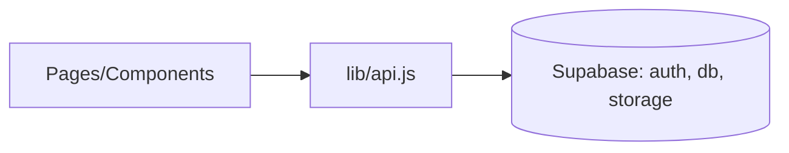

# FlavorShare Frontend (React)

A responsive React application for discovering and sharing recipes, themed with "Ocean Professional", and integrated with Supabase for auth, database, and storage.

## Quick start

1. Install dependencies
   - npm install

2. Configure environment
   - cp .env.example .env
   - Fill in:
     - REACT_APP_SUPABASE_URL
     - REACT_APP_SUPABASE_KEY
     - Optionally set REACT_APP_FRONTEND_URL (used for email redirect on sign-up)
   - Note: Other variables may exist in your container's .env; only the above are required for Supabase integration. REACT_APP_PORT can override the dev server port.

3. Provision Supabase (database + storage)
   - Open your Supabase project -> SQL Editor
   - Run the SQL from: ../supabase/schema.sql
     - Tables: profiles, recipes, tags, recipe_tags, favorites, follows, comments
     - RLS: enabled with policies for select/insert/update/delete
     - Storage: buckets 'recipe-images' and 'avatars' with public read; authenticated users can write
   - Optional: Uncomment and adapt seed examples inside schema.sql to create initial demo data.
   - Ensure Authentication (Email/Password) is enabled in your project.

4. Run the app
   - npm start
   - The dev server uses HOST=0.0.0.0, BROWSER=none and defaults to port 3000 (override with REACT_APP_PORT).
   - Note: In CI/non-interactive mode, if port 3000 is taken, the dev server auto-selects the next free port (e.g., 3001). Check your terminal output for the actual port.

5. Build for production
   - npm run build

## Required environment variables

See .env.example for full list. Minimum required for Supabase:
- REACT_APP_SUPABASE_URL
- REACT_APP_SUPABASE_KEY

Optional:
- REACT_APP_FRONTEND_URL (used for email redirect on sign-up confirmation)
- REACT_APP_PORT (dev server port override)

If REACT_APP_SUPABASE_URL or REACT_APP_SUPABASE_KEY are missing at runtime, the app will warn in console and Supabase requests will fail.

## Features
- Authentication (register, login, logout)
- Recipe CRUD (create, edit, detail)
- Public feed on Home
- Profiles and Settings
- Search with debounce
- Image uploads to Supabase Storage (recipe-images, avatars)
- Accessible, responsive UI

## Current limitations and extension tips
- Filters UI disabled:
  - The SidebarFilters component and tag-based filtering controls have been removed from the UI (Home/Search).
  - The layout now renders content full-width. CSS retains .sidebar class for backward compatibility but is unused.
  - Internal APIs remain intact:
    - tagsApi.listAll() still exists.
    - recipesApi.list(...) still supports tagId for future use, but the UI does not pass tagId anymore.
  - If you re-enable filters in the future, consider reinstating src/components/SidebarFilters.js in pages and pass tagId to recipesApi.list.

- Avatar upload UI is not exposed in Settings yet. The storage helper uploadAvatar(file, userId) is available; you can add a file input in Settings and update profiles.avatar_url with the returned publicUrl.

## End-to-end validation checklist

1) Environment
- Confirm flavorshare_frontend/.env contains:
  - REACT_APP_SUPABASE_URL
  - REACT_APP_SUPABASE_KEY
  - Optional: REACT_APP_FRONTEND_URL = your app origin (used for email redirect)
- Restart the dev server after editing .env.

2) Database & Storage
- In Supabase SQL Editor: run ../supabase/schema.sql.
- Verify buckets exist: recipe-images and avatars (Storage -> Buckets).
- RLS policies allow:
  - Public read on recipes/profiles/tags and on storage buckets (for displaying images).
  - Authenticated users can write; avatars writes are scoped to <uid>/ prefix.

3) Authentication flows
- Register: Navigate to /register and create an account (email/password + username).
- Login: Go to /login; after success, header shows Profile, Settings, Logout.
- Logout: Click Logout; header returns to Login/Register state.

4) Recipe flows with image upload
- Create: Visit /recipes/new (must be logged in), fill Title and choose an image. Submit.
  - Expected: Image uploads to recipe-images bucket; new recipe visible on Home and at /recipes/:id.
- Edit: Go to /recipes/:id/edit; change title and optionally upload a new image. Save.
- Delete: From /recipes/:id, use Delete (only visible to owner). You should be redirected to Home.

5) Search
- Use the header search or /search?q=term.
- Results should update (ilike on title, internal pagination default 12 per page).

6) Profiles & Settings
- /profile/:id shows the user's profile and their recipes.
- /settings allows updating username and bio. Save and confirm changes persist.

7) Avatar upload (UI optional)
- Helper uploadAvatar(file, userId) exists in src/lib/storage.js.
- If you want avatar upload in UI, add a file input in Settings and:
  - Call uploadAvatar(file, user.id)
  - Update profiles.avatar_url with returned publicUrl
- If not implemented, treat as a follow-up task.

8) Visibility rules
- As a guest: browse public profiles and recipes, and see images via public URLs.
- Only the author can edit/delete their recipes (enforced by RLS; UI hides actions for non-owners).

## Troubleshooting tips

- Different dev port than 3000:
  - If 3000 is in use, CRA auto-selects the next port (e.g., 3001). Watch terminal output for the actual URL.
  - You can force a port via REACT_APP_PORT in .env (e.g., REACT_APP_PORT=3002), then restart.

- 401/permission errors:
  - Ensure you are logged in.
  - Confirm you ran ../supabase/schema.sql and RLS policies are active.
  - Check that tables and buckets exist with correct policies.

- Storage upload fails:
  - Verify buckets: recipe-images and avatars.
  - Ensure you are authenticated when uploading.
  - Confirm you are using the public URL returned by supabase.storage.from(...).getPublicUrl.

- Email sign-up redirect:
  - Set REACT_APP_FRONTEND_URL in .env to your app origin (e.g., http://localhost:3001 or your deployed domain).

## Tech
- React 18 + react-router-dom
- @supabase/supabase-js
- Vanilla CSS (src/theme.css) imported globally via src/index.js

## Notes
- Protected routes: create/edit, settings (via components/ProtectedRoute).
- Storage requires buckets: "recipe-images", "avatars" with public access or policies providing read.
- Database tables expected: profiles, recipes, tags, recipe_tags, favorites, follows, (optional) comments.
- If you want private file access, remove the public read storage policies and use signed URLs in src/lib/storage.js.



```diff
+ The main app now mounts RoutesApp in src/index.js
+ Global theme styles are imported from src/theme.css
+ Supabase schema helper added: ../supabase/schema.sql
+ Added end-to-end validation and troubleshooting guide.
+ Added explicit E2E validation checklist and port selection note.
```
