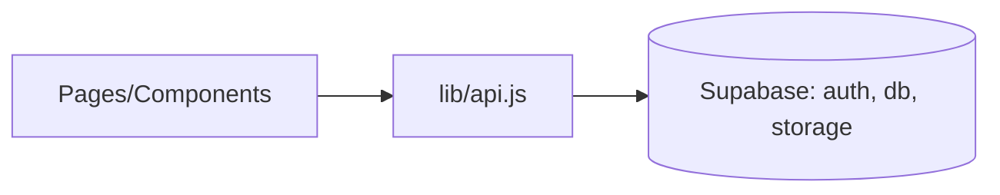

# FlavorShare Frontend (React)

A responsive React application for discovering and sharing recipes, themed with "Ocean Professional", and integrated with Supabase for auth, database, and storage.

## Quick start

1. Install dependencies
   npm install

2. Configure environment
   Copy .env.example to .env and set required variables.

3. Run the app
   npm start
   The dev server uses HOST=0.0.0.0, BROWSER=none and defaults to port 3000 (override with REACT_APP_PORT).

## Required environment variables

See .env.example for full list. Minimum required for Supabase:
- REACT_APP_SUPABASE_URL
- REACT_APP_SUPABASE_KEY
Optional:
- REACT_APP_FRONTEND_URL (used for email redirect on sign-up)

## Features
- Authentication (register, login, logout)
- Recipe CRUD (create, edit, detail)
- Public feed on Home
- Profiles and Settings
- Search with debounce
- Image uploads to Supabase Storage (recipe-images, avatars)
- Accessible, responsive UI

## Tech
- React 18 + react-router-dom
- @supabase/supabase-js
- Vanilla CSS (src/theme.css)

## Notes
- Protected routes: create/edit, settings.
- Storage requires buckets: "recipe-images", "avatars" with public access or policies providing read.
- Database tables expected: profiles, recipes, tags, recipe_tags, favorites, follows, (optional) comments.



```diff
+ The main app now mounts RoutesApp in src/index.js
```
