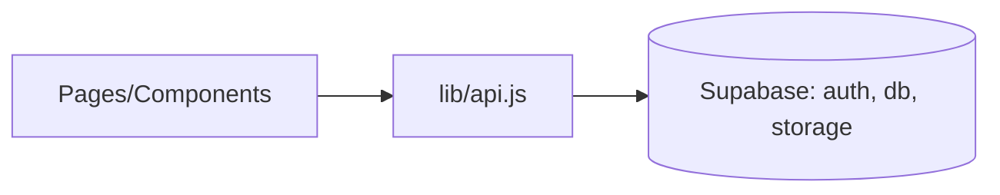

# FlavorShare Frontend (React)

A responsive React application for discovering and sharing recipes, themed with "Ocean Professional", and integrated with Supabase for auth, database, and storage.

## Quick start

1. Install dependencies
   - npm install

2. Configure environment
   - cp .env.example .env
   - Fill in:
     - REACT_APP_SUPABASE_URL
     - REACT_APP_SUPABASE_KEY
     - Optionally set REACT_APP_FRONTEND_URL (used for email redirect on sign-up)

3. Provision Supabase (database + storage)
   - Open your Supabase project -> SQL Editor
   - Run the SQL from: ../supabase/schema.sql
     - Tables: profiles, recipes, tags, recipe_tags, favorites, follows, comments
     - RLS: enabled with policies for select/insert/update/delete
     - Storage: buckets 'recipe-images' and 'avatars' with public read; authenticated users can write
   - Optional: Uncomment and adapt seed examples inside schema.sql to create initial demo data.

4. Run the app
   - npm start
   - The dev server uses HOST=0.0.0.0, BROWSER=none and defaults to port 3000 (override with REACT_APP_PORT).

5. Build for production
   - npm run build

## Required environment variables

See .env.example for full list. Minimum required for Supabase:
- REACT_APP_SUPABASE_URL
- REACT_APP_SUPABASE_KEY
Optional:
- REACT_APP_FRONTEND_URL (used for email redirect on sign-up)
- REACT_APP_PORT (dev server port override)

## Features
- Authentication (register, login, logout)
- Recipe CRUD (create, edit, detail)
- Public feed on Home
- Profiles and Settings
- Search with debounce
- Image uploads to Supabase Storage (recipe-images, avatars)
- Accessible, responsive UI

## Tech
- React 18 + react-router-dom
- @supabase/supabase-js
- Vanilla CSS (src/theme.css) imported globally via src/index.js

## Notes
- Protected routes: create/edit, settings (via components/ProtectedRoute).
- Storage requires buckets: "recipe-images", "avatars" with public access or policies providing read.
- Database tables expected: profiles, recipes, tags, recipe_tags, favorites, follows, (optional) comments.
- If you want private file access, remove the public read storage policies and use signed URLs in src/lib/storage.js.



```diff
+ The main app now mounts RoutesApp in src/index.js
+ Global theme styles are imported from src/theme.css
+ Supabase schema helper added: ../supabase/schema.sql
```
